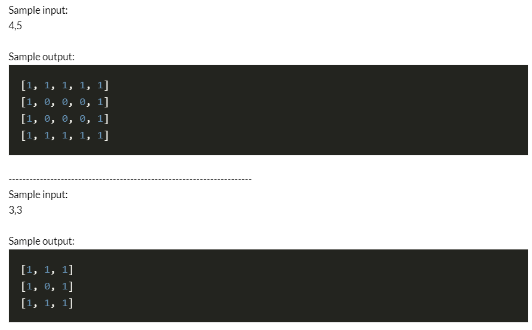
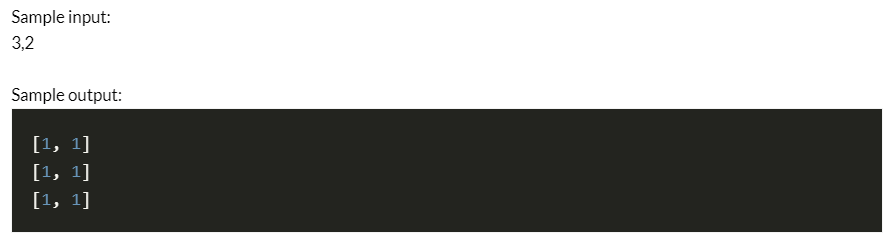

# Title 
Fenced Matrix Problem
# Short Description 
We are given two positive integers m and n.
We have to make a list of lists (which can be visualised as a matrix) of size m*n, that is m sublists (rows), with each sublists having n integers (columns). 
The matrix should be such that it should have 1 on the border and 0 everywhere else. 

The Problem helps one to understand use of lists, list comprehension and differentiates deep and shallow copy.

# Library Used 
for taking direct input we are using " ast "

# Setup Instruction 
Jupyter Notebook or Google Colab can be used to run the program.
# Detailed explanation of script 
Input:
Two integers separated by a space

Output:
A list of lists of size m*n printed like matrix as shown in the sample output.

# Screenshots of Sample Output

# Author 
Mansi Singh
